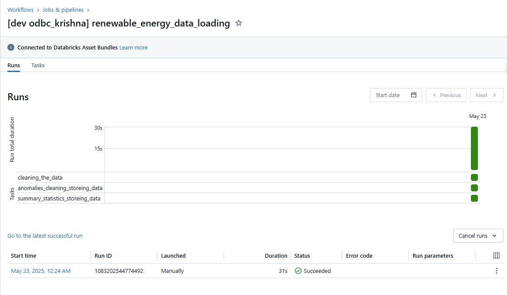

# my_project

The 'my_project' project was generated by using the default-python template.

## Getting started

1. Install the Databricks CLI from https://docs.databricks.com/dev-tools/cli/databricks-cli.html

2. Authenticate to your Databricks workspace, if you have not done so already:
    ```
    $ databricks configure
    ```

3. To deploy a development copy of this project, type:
    ```
    $ databricks bundle deploy --target dev
    ```
    (Note that "dev" is the default target, so the `--target` parameter
    is optional here.)

    This deploys everything that's defined for this project.
    For example, the default template would deploy a job called
    `[dev yourname] my_project_job` to your workspace.
    You can find that job by opening your workpace and clicking on **Workflows**.

4. Similarly, to deploy a production copy, type:
   ```
   $ databricks bundle deploy --target prod
   ```

   Note that the default job from the template has a schedule that runs every day
   (defined in resources/my_project.job.yml). The schedule
   is paused when deploying in development mode (see
   https://docs.databricks.com/dev-tools/bundles/deployment-modes.html).

5. To run a job or pipeline, use the "run" command:
   ```
   $ databricks bundle run
   ```
6. Optionally, install the Databricks extension for Visual Studio code for local development from
   https://docs.databricks.com/dev-tools/vscode-ext.html. It can configure your
   virtual environment and setup Databricks Connect for running unit tests locally.
   When not using these tools, consult your development environment's documentation
   and/or the documentation for Databricks Connect for manually setting up your environment
   (https://docs.databricks.com/en/dev-tools/databricks-connect/python/index.html).

7. For documentation on the Databricks asset bundles format used
   for this project, and for CI/CD configuration, see
   https://docs.databricks.com/dev-tools/bundles/index.html.

8. images screenshot for the proof
	
	
	
	
	
	
